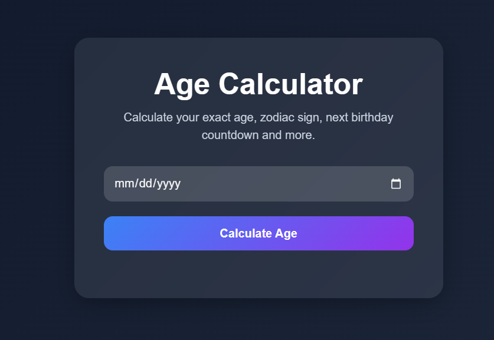
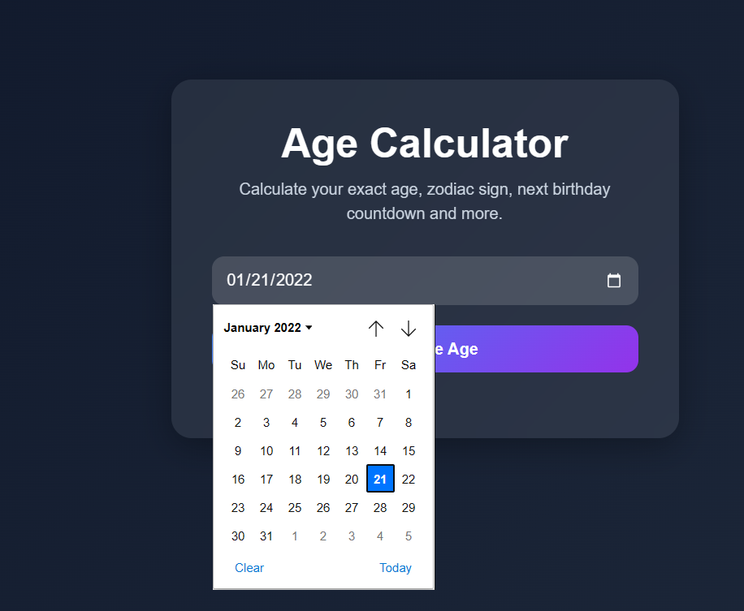
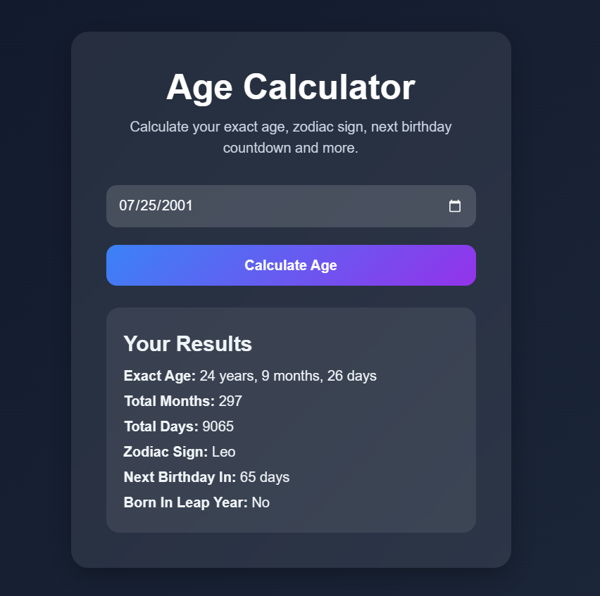
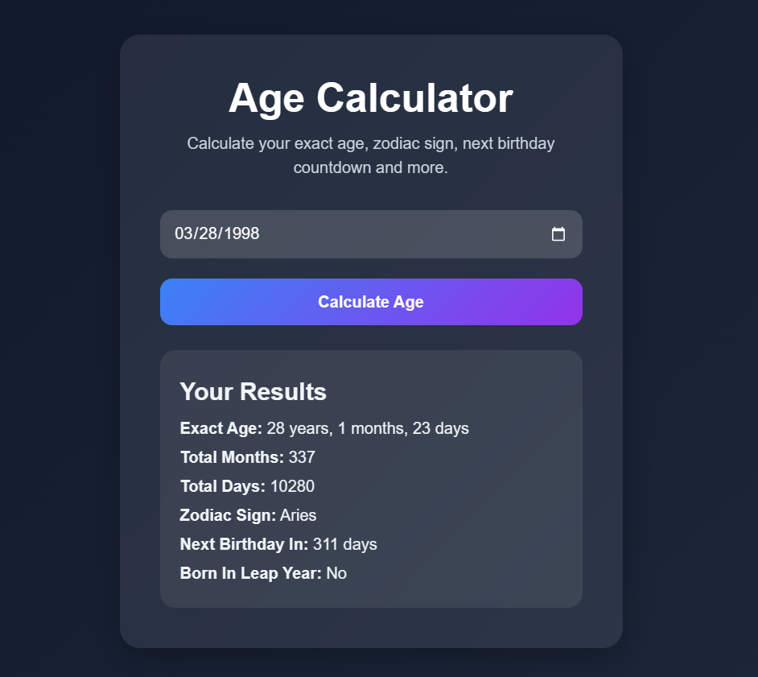
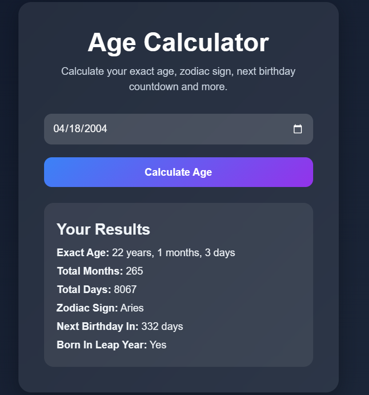
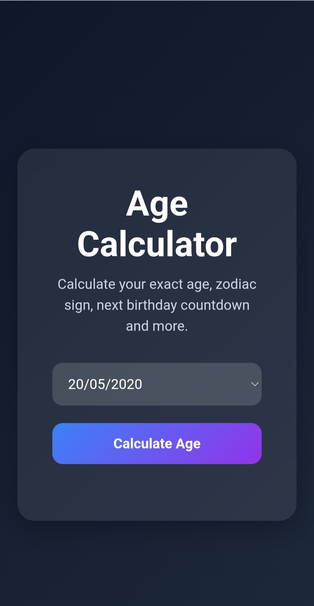
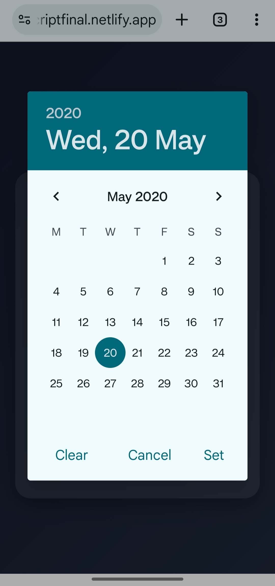
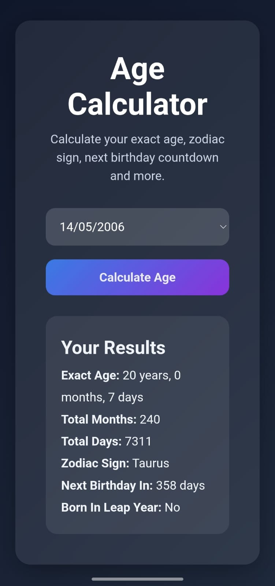

# Age Calculator JS
Modern responsive Age Calculator built using JavaScript with a clean glassmorphism UI and advanced date calculations.

## Live Demo
https://age-calculator-javascriptfinal.netlify.app/

## Features

- Exact age calculation
- Total months calculation
- Total days calculation
- Zodiac sign detection
- Next birthday countdown
- Leap year validation
- Responsive design
- Modern glassmorphism UI
- Real-time calculations
- Date validation

## Tech Stack
- HTML5
- CSS3
- JavaScript

## Screenshots

### Desktop View

### Mobile View

## Installation
1. Clone the repository
git clone https://github.com/mahavirbhandari108/Age-calculator-javascript.git
3. Open project folder
4. Run index.html in browser

## Future Improvements
- Dark/light theme toggle
- Birthday reminder integration
- Animation enhancements
- API-based zodiac insights
- User profile saving

## Author
Mahavir Bhandari
